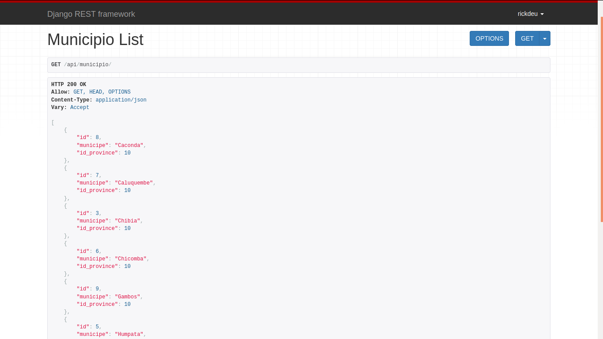

 <h3>4. ROOT API - http://provinciapi.pythonanywhere.com/api/</h3>

  

     

 <h3>4. END PONT PROVINCIA - http://provinciapi.pythonanywhere.com/api/provincia/?format=json</h3>

  

     

 <h3>4. END PONT MUNICIPIO - http://provinciapi.pythonanywhere.com/api/municipio/?format=json</h3>

  

     

 <h3>4. END PONT BAIRROS - http://provinciapi.pythonanywhere.com/api/bairro/?format=json</h3>

  

     

 <h3>4. ADD NEW DATA - http://provinciapi.pythonanywhere.com/admin/</h3>

  

 
 <h3>Para quem estiver interessado em alimentar a API com mais dados, basta acessar o link acima e entrar com os seguintes credenciais</h3>
 
 <h1>Credenciais</h1>
 <b>user: api</b>

 <b>password: huilalubango</b>

