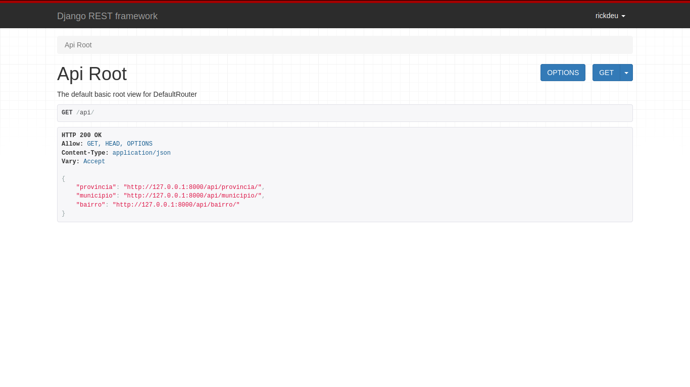
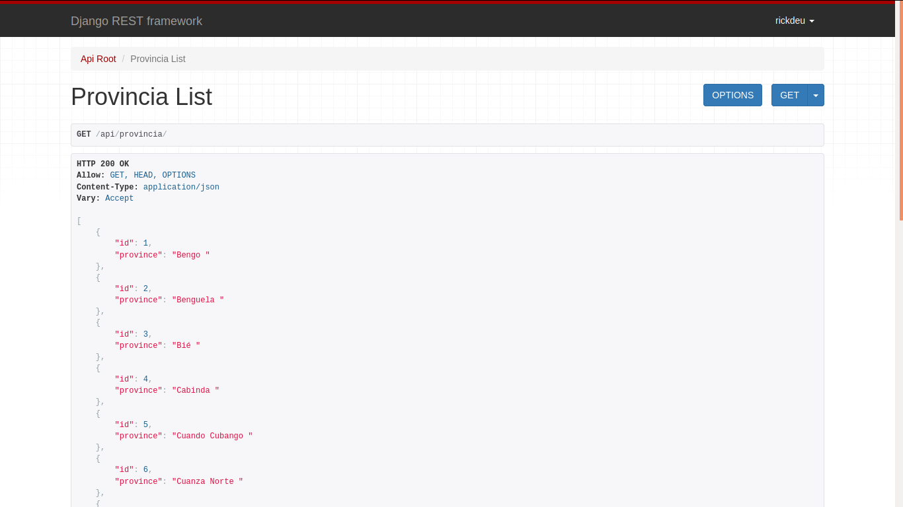

<h1>Como criar uma REST API com Python + Django</h1>

<h2>requirements</h2>
 

    
     <h3>1. API ROOT - http://provinciapi.pythonanywhere.com/api/</h3>

  

     

    <h3>2. END PONT PROVINCIA - http://provinciapi.pythonanywhere.com/api/provincia/?format=json</h3>

  

     

    <h3>3. END PONT MUNICIPIO - http://provinciapi.pythonanywhere.com/api/municipio/?format=json
 </h3>
    
    

  

     

  <h3>4. END PONT BAIRROS - http://provinciapi.pythonanywhere.com/api/bairro/?format=json</h3>

  

     

